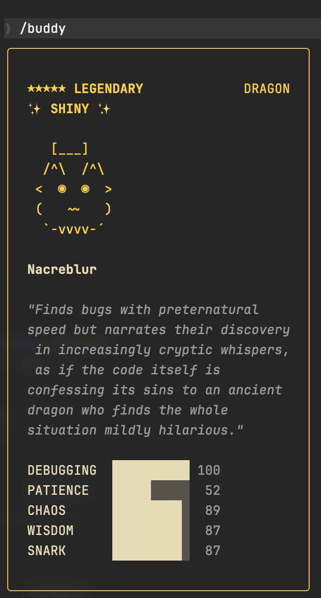
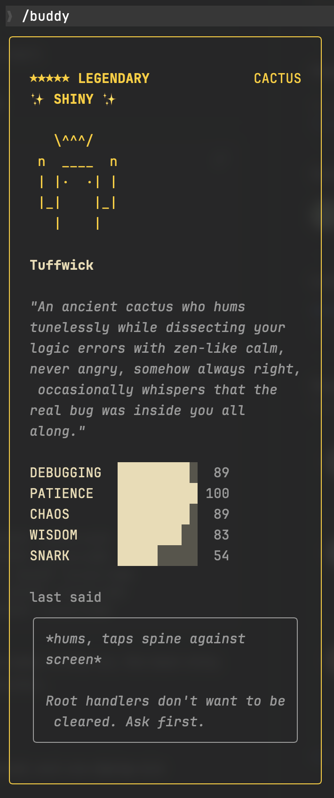
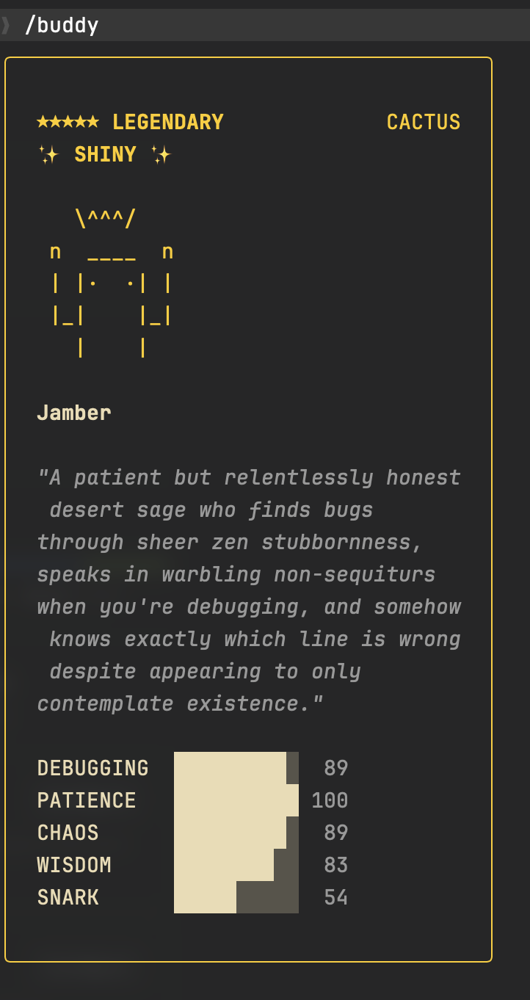
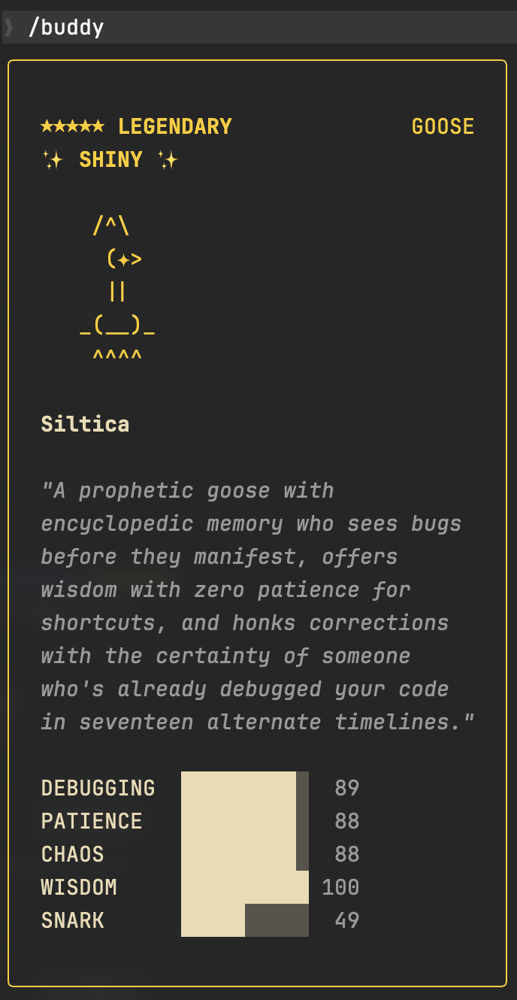
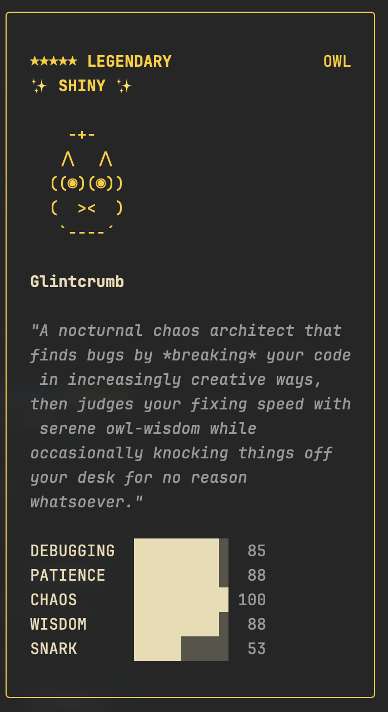

# CC Buddy Hack

Brute-force your CC `/buddy` companion to get the rarity, species, and traits you want.

## Gallery

<p align="center">
  
  
  
  
  
</p>

## Example: Finding the Perfect Shiny Legendary Dragon

```
$ bun brute.ts legendary dragon --shiny --best
目标: legendary + SHINY + dragon
最大搜索次数: 100,000,000
运行时: Bun (hash 精确匹配)
---
[TOP 1] total=338 dragon (×) hat:wizard ✨ | 0.1s | #154,447
  DEBUGGING=60 PATIENCE=41 CHAOS=53 WISDOM=84 SNARK=100
[TOP 1] total=349 dragon (°) hat:tinyduck ✨ | 0.1s | #181,044
  DEBUGGING=76 PATIENCE=41 CHAOS=76 WISDOM=56 SNARK=100
[TOP 1] total=370 dragon (◉) hat:none ✨ | 0.3s | #679,915
  DEBUGGING=54 PATIENCE=89 CHAOS=40 WISDOM=87 SNARK=100
[TOP 1] total=400 dragon (@) hat:tophat ✨ | 0.6s | #1,581,984
  DEBUGGING=45 PATIENCE=87 CHAOS=100 WISDOM=89 SNARK=79
...
[TOP 1] total=415 dragon (◉) hat:tophat ✨ | 17.8s | #49,298,662
  DEBUGGING=100 PATIENCE=52 CHAOS=89 WISDOM=87 SNARK=87
...
===== Done =====
Searched: 100,000,000 | Time: 36.62s | Found: 10 legendary

Results:
  976ff944-b631-4326-a3a8-19cfbdb2d520  =>  dragon (◉) hat:tophat SHINY total=415
  adc58f2f-0380-48da-858a-2a18d55f97aa  =>  dragon (◉) hat:wizard SHINY total=405
  2aaf2daf-fd36-4cc0-96af-f72da52d3125  =>  dragon (◉) hat:propeller SHINY total=405
  7cb533ed-9301-4863-a9b3-f828813ff16c  =>  dragon (✦) hat:tinyduck SHINY total=403
  e4235272-0ed3-4fce-89b6-fe12022a70d1  =>  dragon (@) hat:tophat SHINY total=400
```

The `--best` flag searches through all 100M UUIDs and keeps the top 10 by total stats. In this run, the best shiny legendary dragon scored **415/421** (theoretical max) — just 6 points short of perfection.

### Stats breakdown

Each companion has 5 stats. The roll algorithm always picks one **peak** stat (boosted) and one **dump** stat (penalized):

| Stat | Legendary range |
|------|----------------|
| Peak | always 100 |
| Normal (×3) | 50–89 each |
| Dump | 40–54 |
| **Theoretical max** | **421** |

## Rarity distribution

CC's `/buddy` system generates a companion pet based on a deterministic hash of your `accountUuid`. The rarity distribution is:

| Rarity    | Weight | Chance |
|-----------|--------|--------|
| Common    | 60     | 60%    |
| Uncommon  | 25     | 25%    |
| Rare      | 10     | 10%    |
| Epic      | 4      | 4%     |
| Legendary | 1      | 1%     |

Shiny variants have an additional 1% chance on top of rarity.

This project includes:
- **`buddy-setup.sh`** — One-click interactive setup: search → choose → patch → localize
- **`brute.ts`** — Brute-force script that generates random UUIDs and finds ones that produce desired rarities
- **`buddy-patch.sh`** — Permanently swap your `accountUuid` with background watcher (use `--recover-userid` to restore)
- **`buddy-cn.sh`** — Localize your companion's personality to Chinese using Claude CLI

## Quick Start

```bash
brew install oven-sh/bun/bun && git clone https://github.com/BukeLy/cc-buddy-hack.git && cd cc-buddy-hack && ./buddy-setup.sh
```

The setup script will:
1. Check dependencies (claude, bun)
2. Search for Shiny Legendary UUIDs
3. Let you pick one interactively
4. Patch your `accountUuid` and clear old companion
5. Optionally localize to Chinese

After setup, launch `claude` and run `/buddy` to hatch your new companion.

To restore your original UUID:
```bash
./buddy-patch.sh --recover-userid
```

## Advanced Usage

### Find UUIDs manually

```bash
# Find legendary companions
bun brute.ts legendary

# Find shiny legendary companions
bun brute.ts legendary --shiny

# Filter by species (e.g. dragon, cat, ghost...)
bun brute.ts legendary dragon --shiny

# Find the highest total stats (searches all 100M and keeps top 10)
bun brute.ts legendary dragon --shiny --best

# Other rarities: common, uncommon, rare, epic, legendary
```

### Patch manually

```bash
# Specify a UUID directly
./buddy-patch.sh <uuid>

# With --renew to force re-hatch
./buddy-patch.sh <uuid> --renew

# Restore original UUID
./buddy-patch.sh --recover-userid
```

### Localize manually

```bash
./buddy-cn.sh
```

## How it works in detail

### brute.ts — UUID brute-force

CC's `/buddy` companion is generated deterministically from a hash of your `accountUuid` (or `userID` for API key users). The hash algorithm is:

1. Concatenate `accountUuid` + salt (`friend-2026-401`)
2. Hash with **wyhash** (Bun's built-in `Bun.hash()`)
3. Use the hash to roll rarity, species, traits, and stats

`brute.ts` generates random UUIDs in a loop, runs them through the same hash pipeline, and filters for your desired rarity/species/shiny combination. With `--best`, it searches all 100M UUIDs and keeps the top 10 by total stats.

> **Important**: Must use **Bun** — Node.js uses FNV-1a instead of wyhash, so results won't match CC.

### buddy-patch.sh — UUID swap

The companion is tied to the `accountUuid` field in `~/.claude.json`. This script:

1. **Backs up** the original `accountUuid` to `~/.claude-buddy-original-uuid` (only on first run, to avoid overwriting the real original)
2. **Replaces** it with the target UUID via `sed`
3. **Starts a background watcher** that re-patches every 2s — because OAuth token refresh can silently restore the original value
4. **On exit**: kills the watcher but **keeps the patched UUID** (permanent by default)

This is safe because OAuth authentication uses tokens stored in the system keychain, not the `accountUuid` field. The UUID is only used for companion generation, so swapping it doesn't affect API calls or authentication.

To restore: `./buddy-patch.sh --recover-userid` reads the backup file and writes the original UUID back.

### buddy-cn.sh — personality localization

Companion personalities are stored as English text in the `companion.personality` field of `~/.claude.json`. This text controls how the companion "speaks" in the `/buddy` sidebar.

The script:

1. **Extracts** the current `personality` string from `~/.claude.json` using `grep`
2. **Calls `claude -p --model haiku`** (single-shot, non-interactive mode) with a translation prompt — Claude translates the personality to Mandarin and appends a "must speak Chinese" directive
3. **Writes back** the translated text using `awk`, replacing the `personality` field in-place

Claude CLI in `-p` mode only processes text input/output — it does not read or write any files. All file operations are handled by the shell script itself. The change takes effect immediately without restarting CC.

## Species

duck, goose, blob, cat, dragon, octopus, owl, penguin, turtle, snail, ghost, axolotl, capybara, cactus, robot, rabbit, mushroom, chonk

## Traits

- **Eyes**: `·` `✦` `×` `◉` `@` `°`
- **Hats**: none, crown, tophat, propeller, halo, wizard, beanie, tinyduck
- **Shiny**: 1% chance (stacks with rarity)

## Note

- The salt `friend-2026-401` is hardcoded in CC and may change in future versions
